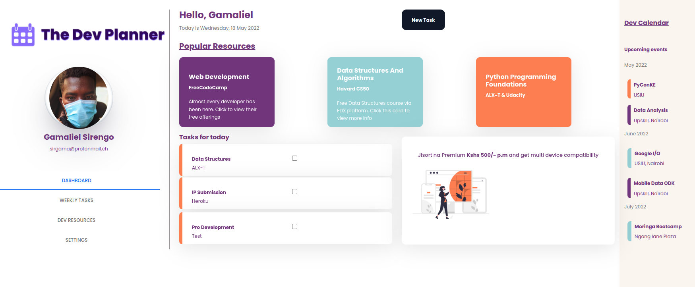

# Dashboard Design Concept

## Table of Contents

- 
  - [Table of Contents](#table-of-contents)
  - [Description](#description)
  - [Installation](#installation)
    - [SITE LINK - GH-PAGES](#site-link---gh-pages)
    - [Technology Used](#technology-used)
  - [Known Bugs](#known-bugs)
  - [Author(s)](#authors)
  - [License](#license)
  - [Contact](#contact)

## Description

Dashboard design concept using HTML and CSS.

## Installation

If you want to clone this repository to your local machine, use the following command: 

<code> $ git clone https://github.com/sirgama/Dashboard-Design.git</code> 
<code>$ cd Dashboard-Design</code> 

if you are using VS-code, run this: 
<code>$ code .</code>

### SITE LINK - GH-PAGES
The landing page is being hosted by Github Pages. The link to the page is:

<a href="https://sirgama.github.io/dashboard-design/">https://sirgama.github.io/Dashboard-Design/</a>

### Technology Used
* HTML - which was used to build the structure of the pages.

* CSS - which was used to add custom styling to MDbootstrap classes.

* MDBOOTSTRAP - Used to add responsiveness for small screens.

## Known Bugs

If you find any other issue(s), kindly raise a ticket.

## Author(s)

Gamaliel Sirengo - Software Dev.

## License

MIT License

Copyright (c) [2022] [Gamaliel Sirengo]. All Rights Reserved.
<a href="./LICENSE"> LICENSE</a>

## Contact
* EMAIL - sirgama@protonmail.ch
* TELEGRAM - https://t.me/sirgama
